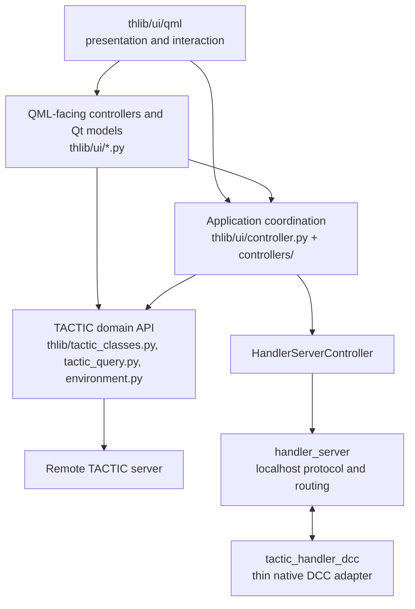

# Application architecture

This document records the current architecture after the QML application client became
the primary development line. It is both a map of the implementation and a set of
dependency rules. `thlib/side` is vendored code and is outside this audit.

`thlib/side/client` is the bundled upstream legacy TACTIC client. It provides
the transport and compatibility API used by the core object model; it is not
application-owned feature code and must remain complete. Changes there are
limited to an explicit upstream sync or a separately reviewed client fix.
The application itself supports Python 3 only, even where this client retains
older compatibility code.

## Dependency direction

Dependencies point downward. QML may bind to properties, invoke slots, and emit UI
intent, but it does not perform network, filesystem, repository, or TACTIC business
operations. Core `thlib` modules outside `thlib.ui` must not import presentation modules. Application UI Python must not open removed
`thlib.ui_classes` or QWidget interfaces. The only allowed QtWidgets imports in
`thlib.ui` are the composition root and Windows tray platform adapter.

## Module map

| Module | Purpose | May depend on |
|---|---|---|
| `thlib/ui/application.py` | Thin process entry point: creates Qt/QML hosts, delegates composition, loads QML, and starts guarded runtime work. | `application_composition`, `application_runtime`, and host-only Qt APIs; no feature graph or domain behavior. |
| `thlib/ui/application_composition.py` | Explicit feature composition root. Builds typed feature bundles, wires cross-feature signals, and declares each public QML binding next to its owner. | Feature controllers and `application_runtime`; no Qt window hosting. |
| `thlib/ui/application_runtime.py` | Validated QML namespace and ordered, idempotent lifecycle contracts retained by `ApplicationRuntime`. | Generic Python contracts only; no feature construction. |
| `thlib/ui/qml/` | Presentation, responsive layout, view-local transient interaction, and reusable MD3 controls. | QML controls, theme/localization, exposed controller/model APIs. |
| `thlib/ui/controller.py` | `ApplicationController` façade for connection, project/navigation/search sessions, selected workspace item, window/dock actions, and application lifecycle. | `thlib/ui/controllers`, workspace models, independent `thlib` APIs. |
| `thlib/ui/controllers/` | Cohesive mixins implementing the application façade: connection, navigation, search, selection, result tree, item/snapshot actions, commands, and lifecycle. | Workspace models and independent core APIs; never legacy widgets. |
| `thlib/ui/workspace_models/` | Qt models and mutable workspace presentation state, including results, selection, docks, floating windows, and their persisted geometry/layout. | QtCore and value/data helpers. |
| `thlib/ui/tasks.py`, `task_workspace/` | Task workspace orchestration, normalized task store, catalogs, filters, bulk edits, Gantt/calendar/table projections, and task workers. Pure Gantt date transformations live in `task_workspace/gantt_schedule.py`; the controller owns QML slots, state, history, and persistence. | Application selection context and `thlib` task APIs. |
| `thlib/ui/communication.py`, `communication_feed.py` | Notes, Messages, Activity Feed, unread state, incremental server updates, and navigation intents. | Shared message/attachment helpers and `thlib` communication APIs. |
| `thlib/ui/server_updates.py` | One incremental polling loop for messages, activity, reactions, and presence heartbeat. Owns cursors, retry policy, and timer lifecycle. | Application session/project identity and one batched core API. |
| `thlib/ui/configuration.py` | Editing façade for user-visible settings. Reads/writes the same keys and invokes the same apply callbacks as functional owners. | Project `env_read_config` / `env_write_config` API and application/controller callbacks. |
| Specialized `thlib/ui/*_controller.py` modules | Feature-specific operations such as commit queue, check-in/out, repository sync, work hours, users, milestones, scripts, and Handler Server. | Native TACTIC objects/core APIs and shared Qt models. |
| `thlib/tactic_classes.py`, `tactic_query.py` | TACTIC object model, server-side procedures, repository/file/snapshot semantics, and public core API. | `thlib` infrastructure and the complete bundled legacy TACTIC client transport. |
| `thlib/environment.py`, `pool.py` | Session/project registries and execution pools. | Core/Qt compatibility only; never presentation modules. |
| `handler_server/` | Local framed protocol, discovery, authentication, client registry, routing, timeout, reconnect, and fixed command registries. | Standard library and explicit protocol adapters. |
| `tactic_handler_dcc/` | Thin DCC SDK, Handler object API transport, and application-specific connectors such as Maya. | Standard library and DCC-local APIs only. |
| `tests/` | Behavioral tests plus static architecture guards. | Public modules and source inspection. |

## State ownership matrix

An owner is the only component allowed to authoritatively mutate a state. Other
copies listed below are derived views or currently duplicated state discovered by
the architecture audit. Recorded duplicates are not consolidated without a concrete
behavioral reason.

| State | Authoritative runtime owner | Persisted owner | Derived mirrors / duplicates found |
|---|---|---|---|
| Session, login, server ticket and native connection | `thlib.environment.env_server` and `env_inst` | Project server preset/config API | `ApplicationController` mirrors connection/login for QML; `ServerUpdateService` keeps a session tuple only to invalidate cursors. These mirrors must remain derived. |
| Current project | `ApplicationController` for UI selection; `env_inst.projects` for native project objects | Application settings and restored search session | `WorkspaceState._project`, Tasks, Messages, and feed controllers retain target/project references. They are consumers, not project selectors. |
| Search tabs and result selection | `ApplicationController._sessions` for tab definitions; `WorkspaceState` for current selected native sObject and result models | ApplicationController search-session cache and per-tab settings | Task/Notes controllers mirror target search keys; request ids and loaders duplicate only operation state. |
| Task workspace | `TasksController` for commands/filters/selection; `TaskWorkspaceStore` for the normalized task collection | Task-specific settings owned by `TasksController`/field catalogs | `WorkspaceState.task_model` is an older compact projection and is a consolidation candidate; inspector and Gantt models are derived projections. |
| Notes | `CommunicationController` | Notes view settings in the functional controller | `WorkspaceState.note_model` and selected process are the dock-facing projection; task inspector mirrors the target/process. |
| Messages and unread state | `MessagesController` | Message UI/read cursors in its settings namespace; server read state remains in TACTIC | `ServerUpdateService` owns polling cursors but not read state; notifications are derived events and do not mark messages read. |
| Activity Feed | `ActivityFeedController` for visible feed records; `ServerUpdateService` for incremental cursor | Last-read/feed UI state in functional settings | User recent activity is another projection over shared activity records and must not become a second server source. |
| Windows | `FloatingWindowModel` registry | `workspace/floatingWindows` in `ui_main/ui_settings` through the project config API | QML `WindowHost` owns only live visual instances; geometry passed back to the registry is authoritative. |
| Docks | `DockPanelModel` and its layout tree | `workspace/dockLayout` in `ui_main/ui_settings` through the project config API | QML dock hosts own pointer/hover state only; stack selection, placement, ratios, and visibility belong to the model. |
| Background operations | The feature controller that starts the operation; the current `env_inst` compatibility adapter owns instance-local thread pools | No persistent operation state unless the feature explicitly queues work | Busy/progress/error flags exist per controller. New UI dependencies are injected by composition; existing `env_inst` consumers are migrated by vertical feature slices and may not increase. |
| Caches | The component that defines the cached value: search sessions and Search Type facet projections in `ApplicationController`, task catalogs in task workspace, skey previews in their resolver, native objects in `env_inst` | Server-backed facet catalogs use the shared `reference` cache; only explicitly durable caches use their component key | Several target/project identity mirrors exist. A future consolidation must preserve cache scope and invalidation, not create a generic global cache. |
| User-visible configuration | The functional controller that consumes each key | Project `env_read_config` / `env_write_config` namespaces such as `ui_main` and `ui_conf` | `ConfigurationController` is an editor façade, not a second source of truth. Key ownership stays explicit. |
| Qt Quick rendering backend | `thlib/ui/rendering.py` normalizes and applies the preference before `QApplication` is created | `appearance/renderBackend` in `ui_main/ui_settings`; `QSG_RHI_BACKEND` and `QT_QUICK_BACKEND` remain explicit process-level overrides | Automatic mode selects OpenGL on Windows to avoid full-display DXGI/MPO/HDR flicker and otherwise leaves Qt's native platform default unchanged. Software selects the Qt Quick software scene-graph adaptation rather than an invalid RHI backend. |

## Lifecycle

### Application startup

1. `thlib/ui/application.py` reads and applies the Qt Quick renderer preference,
   then creates the Qt application and acquires the
   `TacticHandler_Client` local-server name before pools, polling, or feature
   controllers start. A second launch asks the existing process to restore its
   main window and exits without creating another runtime. Isolated smoke runs
   derive a private server name from their temporary settings directory.
   Before creating Qt on Windows, the same entry point sets the stable process
   AppUserModelID `TACTIC.Handler.Desktop`. Both `launch.py` and `launch.pyw`
   therefore identify Handler rather than their Python host to the taskbar.
   Qt's existing application icon (`thlib/ui/assets/tactic_favicon.ico`) remains
   the default for all application windows and the tray. Windows registration is
   performed before UI creation as required by
   [SetCurrentProcessExplicitAppUserModelID](https://learn.microsoft.com/en-us/windows/win32/api/shobjidl_core/nf-shobjidl_core-setcurrentprocessexplicitappusermodelid).
   `tests.test_application_identity` launches both entry points with isolated
   offline settings, reads back the real process ID and verifies the QML window
   icon; with `QT_QPA_PLATFORM=windows` it also checks both native window icons.
2. The primary process installs the shared Debug Log bridge.
3. `build_application_runtime()` constructs explicit core, task, collaboration,
   delivery, and editor bundles. Dependencies and cross-feature signals remain visible
   in `application_composition.py` rather than being hidden in a service locator.
4. `QmlBindingRegistry` validates a unique public QML namespace and publishes the
   current compatibility bindings before `Main.qml` is loaded. QML construction must
   not start TACTIC mutations. New feature roots receive required controller/model
   properties directly; the context-property count is debt with a decreasing budget,
   not an extension mechanism.
5. Zero-delay startup jobs bootstrap the TACTIC session, start the local Handler
   Server in the background, and start the incremental server-update service.
6. Restored tabs, selected sObject, docks, and windows are applied after their models
   exist. Stale worker results are rejected by controller request ids.
7. After the first QML window is ready, `UiHangWatchdog` monitors the Qt event-loop
   heartbeat from a daemon thread. A 15-second stall writes every Python thread
   stack and, on Windows, `MiniDumpWithThreadInfo` into `log/ui_hang_*` without
   waiting for the blocked UI thread. It then starts an out-of-process native
   error with the dump path and terminates the unrecoverable process.

Project metadata hydration belongs to `tactic_classes.Project`, not the sidebar.
Every project has an initialized `ViewsConfig`; loading its Search Types and views
does not require a production schema or pipelines. This includes `admin`, `sthpw`
and newly created projects. Native system schema/pipelines are retained, never
replaced by dummy values. An empty loaded Search Type mapping is distinct from
`None` (not loaded), so GUI model projection cannot trigger another catalog query.
`tests/test_project_metadata.py` covers first load, cache hydration, refresh,
preserved transport failures, and worker preparation followed by real controller
and Qt model publication for both builtin projects.

Sidebar element names are UI identities, not Search Types. `NavigationModel`
retains links without an explicit `search_type` as unavailable rows (with an
explanation in the drawer). Project opening and cached-workspace restoration
consider only available search links. Navigation rejects stale/unconfigured
sidebar commands before creating a Search session; only direct navigation with
no sidebar entry derives its type from the explicit search key. The XML remains
unchanged and can still be edited in Sidebar Editor. This prevents system menu
items such as `Column_Manager` from becoming invalid automatic database queries.
`tests/test_sidebar_navigation_targets.py` covers startup, cached invalid tabs,
direct commands and valid links; `tests/test_sidebar_editor_qml.py` exercises
the actual drawer with mouse, keyboard and touch.

### Windows and docks

- A standalone window has exactly one registry record in `FloatingWindowModel`.
  `show_window` raises that singleton record; QML does not create an unbounded set of
  copies. Visibility, z-order, modal policy, and final geometry return to the model.
- A dock has exactly one record in `DockPanelModel` and one location in its layout
  tree. Stacking, swapping, detaching, resizing, and reset mutate the model. Pointer
  deltas stay in stable coordinates and only final geometry is persisted.
- Dock content is instantiated asynchronously on first activation. An inactive or
  just-closed dock retains its QML instance for a five-second grace period so quick
  tab switches and reopen actions do not rebuild heavy views; the instance is then
  released to keep memory bounded.
- Closing a view ends its view-local connections/timers. Feature operations either
  remain owned by their controller or are cancelled according to that controller's
  explicit lifecycle; destroying QML is never the cancellation mechanism.

### Workers and shutdown

- Existing controllers create workers in the appropriate `env_inst` compatibility
  pool, retain their handle/request id, and update Qt models only in result/error
  callbacks on the Qt side. New controllers receive their executor explicitly from
  composition. Re-entry is rejected or supersedes the prior request explicitly.
- Timers belong to their service/controller. `ServerUpdateService` is the owner of
  the regular messages/activity/presence poll; features must not add parallel polls.
- The same poll reads `change_timestamp` by its real `project_code` column, but
  scopes `retire_log` through the project embedded in `search_type` because
  `retire_log` has no `project_code`. Server-side SQL errors are not swallowed:
  TACTIC 4.9 keeps the PostgreSQL transaction aborted after such an error, so any
  later query would otherwise report a misleading secondary failure.
- Shutdown is ordered by `LifecycleRegistry` in `thlib/ui/application_runtime.py`: stop server updates, tasks/work-hours and
  attachment workers, watch/screenshot work, Handler Server, notifications and
  commit queue, then `ApplicationController`; the latter flushes settings/cache,
  stops repository sync, and exits shared pools. Debug Log is closed last.
- The UI hang watchdog stops immediately after `app.exec()` returns. It owns no
  feature state; feature controllers remain responsible for non-blocking
  checkpoints of user-authored drafts before a fatal stall.

## Standalone and DCC boundary

The standalone application owns TACTIC authentication, native TACTIC objects,
repository paths/downloads, check-in preparation and submission, application UI state,
and user-visible results. Handler Server exposes only authenticated localhost
routing with request ids, timeouts, heartbeat, structured errors, and redacted
logging.

A thin DCC client registers its application type, process id, client id, and fixed
capabilities. It executes only native application actions such as scene open,
reference, import, save, selection, or playblast preparation. It does not import the
full Handler, access TACTIC, upload snapshots, or execute code received over the
network. The selected client id—not global `env_mode`—determines available DCC UI
actions. See `docs/handler_server_architecture.md` for protocol details.

## Enforced boundaries

`tests/test_architecture_boundaries.py` fails when any of these regressions appear:

1. Core `thlib` modules outside `thlib.ui` import presentation modules.
2. Application UI Python imports removed QWidget UI packages.
3. QtWidgets spreads beyond the composition root and explicit tray platform adapter.
4. QML contains transport, storage, or TACTIC server business logic.
5. The thin DCC SDK imports the full Handler layers.
6. Domain controllers/services/resolvers form a static import cycle.
7. The number of UI modules that reach through the `env_inst` service locator grows.
8. The global QML context namespace grows instead of moving feature dependencies to
   required properties or typed QML APIs.
9. The application façade/mixin method surface or the item-action dispatcher grows
   instead of moving a complete behavior to a feature-owned controller.

Importing `thlib.environment` must not change process-wide interpreter policy.
`Inst` owns its mutable registries and pools per instance.

The Snapshot Browser file editor uses the schema-driven QML sObject editor.

## Executable architecture contracts

The layered test harness enforces these boundaries. Server procedures,
returned shapes, code-based identities, metadata, native object behavior, and the
public `thlib` API are contract-tested. Deterministic controller scenarios exercise
worker cancellation, stale results, persistence, and cache invalidation. The real
QML composition root is loaded offscreen with isolated settings and no network,
then every standalone window is reopened before ordered shutdown. Request/cache
metrics enforce stable call-count budgets. See `docs/testing_strategy.md` and
`docs/tactic_test_project.md`.

## Stabilized workflow verticals

Workflow validation exercises the application as six user workflows rather than as isolated
windows: login/configuration, navigation/search, tasks/notes/work hours,
check-in/files, messages/users/activity, and Handler Server/DCC. Their single
manifest maps every workflow to contract tests, controller tests, QML components,
registered windows, and guarded live checks. The shared contract and offscreen QML
smoke layers run for every vertical. See `docs/vertical_stabilization.md`.

## Structural ownership and UI policy

Application hosts do not own feature content. `FloatingWindowModel`
is the single standalone-window registry and supplies each component source and
its construction parameters; `WindowContent.qml` is now only a generic loader.
`DockHost.qml` owns placement, stacking, detaching, and resizing, while the
existing dock content components live in `DockContentRegistry.qml`.

Retained UI data has an explicit owner, key, TTL decision, invalidation event,
refresh entry point, stale-data rule, and maximum size. See
`docs/cache_invalidation_policy.md`. Shared control rules and the deliberately
deferred Results/ApplicationController splits are recorded in
`docs/ui_component_policy.md`. Structural tests prevent the hosts from
absorbing content again and forbid raw common Qt controls outside the shared
control library.

## Release and cutover gate

The release gate makes readiness executable without pretending that offline automation can
certify a live TACTIC repository or DCC host. `tests/run_release_gate.py` is the
single strict automated entry point: it checks the worktree, syntax, isolated
contracts and scenarios, offscreen QML lifecycle, application boundaries, and both
application entry points from another working directory. Environment-dependent mutation,
repository, Windows lifecycle, Maya and visual checks remain explicit required
manual acceptance. See `docs/release_readiness.md` and
`tests/contracts/release_acceptance.json`.
