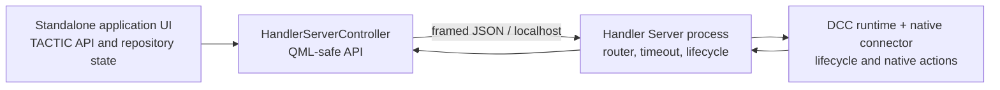

# Handler Server and thin DCC clients

## Purpose

The subsystem keeps TACTIC access, repository work, snapshot selection, and application
state outside Maya. A DCC process loads only the transport, command registry,
and its connector. The pre-existing `thlib/tactic_server.py` and
`tactic_api_server.py` are Qt local-socket experiments with full application imports;
they were inspected but not modified or reused as the DCC bridge.

## Modules

| Module | Responsibility |
|---|---|
| `handler_server/protocol.py` | framing, versioning, validation, size limit, message factories |
| `handler_server/server.py` | localhost listener, handshake, clients, heartbeats, auto-target selection |
| `handler_server/router.py` | request ownership, result routing, cancel, timeout, disconnect errors |
| `handler_server/client.py` | reconnecting thin client and command execution boundary |
| `handler_server/registry.py` | explicit allow-list of callable actions; no `eval` or `exec` |
| `handler_server/demo_adapter.py` | dependency-free text-document example |
| `handler_server/demo_maya_adapter.py` | Maya-shaped standalone adapter for UI and routing tests |
| `handler_server/launcher.py` | separate Handler Server process entry point |
| `thlib/ui/handler_server_controller.py` | process lifecycle and QML-safe client/result models |
| `thlib/ui/tactic_rpc.py` | Handler object API transport, session-owned handles, and UI command dispatch |
| `tactic_handler_dcc/` | DCC SDK and remote Handler API objects |
| `tactic_handler_dcc/runtime.py` | shared DCC discovery, standalone autostart, reconnect, hot reload, and local custom-script runner |
| `tactic_handler_dcc/maya.py` | Maya entry point and Maya-native notification presentation |
| `tactic_handler_dcc/connectors/maya.py` | Maya capabilities, main-thread dispatch, scene preparation, editor-file execution, and local `mf()` helpers |
| `HandlerServerView.qml` | clients, capabilities, command payload, timeout, results |

## Lifecycle

1. The application UI generates a cryptographically random session token.
2. It starts `python -m handler_server.launcher` in a separate process and passes the
   token only through the child environment.
3. The server binds an ephemeral port on `127.0.0.1` and atomically publishes a
   per-user discovery record under local application data. The record is readable
   only in the user's local session and contains the random handshake token.
4. The UI connects as `tactic_handler`; DCC clients find the newest live record and
   connect independently without connection parameters.
5. Each client completes `hello`, registers id/application/pid/capabilities, and
   begins heartbeat exchange.
   A connected client may re-advertise its own allow-list after a hot reload;
   the server broadcasts the updated client record without reconnecting it.
6. The user selects the active DCC client in the main header. UI capabilities and
   context actions come from that exact client, and commands target its id.
7. Each client uses a generated id unless an integration supplies a stable one, so
   multiple Maya, Blender, and demo processes are registered separately.
8. Maya `startup(path)` returns immediately. Discovery, standalone application
   launch, and the connection wait run in a daemon bootstrap thread. Repeated
   startup reuses the active client and restores the Handler window; Maya's
   exiting callback stops the current client.
9. Timeout, connection loss, operator disconnect, or an unexpected server-process exit
   completes every pending UI request exactly once with a structured error. The Qt
   lifecycle callback closes the operator socket without joining client threads, so a
   failed bridge cannot block the GUI while its workers unwind. Clients may reconnect
   with the same client id.
10. Server restart is rediscovered on the next reconnect. Application shutdown removes
   the discovery record and stops clients, demo process, and server process in order.

The standalone UI starts Handler Server automatically after QML has loaded. A manual
stop uses the authenticated local operator connection; process termination is only a
bounded fallback when graceful shutdown does not complete.

## Snapshot and DCC workflow

The standalone client remains responsible for TACTIC search, repository selection,
download, overwrite policy, and local path verification. The local path plus safe
options is sent to the Handler Server only after preparation.

| UI operation | Routed action | Registered capability | Result |
|---|---|---|---|
| Open snapshot | `open_scene` | `open_scene` | success/cancelled/error/opened path |
| Import snapshot | `import_file` | `import_file` | same |
| Reference snapshot | `reference_file` | `reference_file` | same |
| Save current scene | `get_current_scene`, then `prepare_checkin` | `get_current_scene`, `prepare_checkin` | TACTIC-named scene/playblast paths |
| Get current scene | `get_current_scene` | `get_current_scene` | path/modified/type/workspace/optional selection |
| Run saved DCC script | `execute_custom_script` | `execute_custom_script` | captured stdout/stderr |
| Run new/edited Script Editor buffer | `execute_script_file` | `execute_script_file` | captured stdout/stderr |
| Copy active shelf to Maya | `create_script_shelf` | `create_script_shelf` | saved native Maya shelf |

The main UI preserves its standalone runtime. The selected client's application type
acts as the current UI environment, while capability checks expose only supported DCC
actions. Existing Check-in/Out downloads still use the normal repository engine;
only the final DCC-specific action crosses the bridge.

Connector manifests are discovered without a central DCC list. Standard file
actions come from the selected client's registered capabilities, so a new DCC
adds its connector and startup module without edits to Handler Server, the
application composition root, context menus, or script-trigger actions.

`tactic_handler_api.get_api()` exposes the Handler object API. Calls execute in standalone
TACTIC-Handler; returned objects remain chainable session-owned handles.
`th.ui` provides navigation and window commands.

When a connector registers both `get_current_scene` and `prepare_checkin`, Save
Scene adds its declared scene extension and optional preview to Commit Queue.
Queue validation resolves the virtual snapshot. Commit then routes the fixed
save command back to that exact client with the final versioned paths.
Standalone TACTIC-Handler subsequently performs the repository transfer and
server-side check-in. Maya uses this contract with an optional playblast; a new
DCC does not require another application-type branch in the queue controller.

## Security boundary

- listener is localhost-only and rejects non-loopback configuration;
- token is random per server session and compared with constant-time comparison;
- message size is limited to 1 MiB and command timeout to 300 seconds;
- client id, application type, process id, capabilities, request id, and sender are
  registered or server-controlled;
- DCC-side execution is limited to callbacks in `CommandRegistry`;
- standalone RPC permits only the object methods and properties listed in
  `tactic_handler_api/contract.py`, through `handler.call`, `handler.release`,
  and `handler.close`;
- command logs include sender, target, action, and request id, never token/payload;
- Python source and callable expressions are never protocol payloads. The
  trusted Script Editor routes an unchanged saved script by validated project
  and relative path to `execute_custom_script`; a draft uses only a randomized
  `.py` path inside its application-owned temporary directory through
  `execute_script_file`;
- remote peers cannot connect to the loopback listener.

## Running Maya

The production entry point is `tactic_handler_dcc.maya.startup(handler_path)`.
It attaches to a live local Handler session or starts `launch.pyw` as a
separate process and reports progress in Maya. The Handler Server window and the
simulated client are diagnostics only and are not part of this startup path.
For a clean Maya installation, drag `installer/drop_install.mel` into the Maya
viewport. The installer downloads the configured ZIP, installs it under the Maya
installer directory by default, and recreates the `Niki_And_Friends` shelf.
Animation, Modelling/Rig, and Full presets reproduce the legacy button sets;
every button loads only the thin connector and dispatches an installed custom
script when required. Standalone configuration is not copied into Maya.
Shelf creation happens before package download, so a failed download can be
recovered by copying the application into the selected `TACTIC-handler` path.
The documented shelf bootstrap reloads the thin runtime before calling
`startup`. A live client survives that reload and is reused; a new connection
reloads the thin environment, session, and Maya connector modules so Maya cannot
retain stale capabilities from its Python module cache. A reused connection
immediately re-advertises the refreshed registry to Handler Server.
The main header provides the exact client selector. Opening it refreshes each
client's application version and current scene name and shows those details with
the process id; it does not poll DCC clients while the menu is closed.

See `tactic_handler_dcc/README.md` for shelf startup, API access, UI calls,
custom scripts, restart, and shutdown.

Server-backed custom scripts are synchronized from `config/custom_script` into
the local execution tree at startup and whenever the shared server-update poll
reports a script change for the current project. Startup first compares the
script manifest timestamps with local file modification times and downloads
script bodies only when the mirror differs. The requested project is applied
to the standalone environment before the runner imports project modules; Maya
receives only the thin environment proxy and native DCC work.

Custom scripts remain the orchestration layer above these primitives. The DCC
SDK must not absorb project-specific script functions. When an unchanged legacy
script fails because a public API name disappeared, compatibility belongs in the
original `thlib` or application-command owner (for example,
`get_sobjects_new = get_sobjects`), not in a new script-specific DCC wrapper.

## Version 1 limitations

- transport is dependency-free length-prefixed JSON/TCP, not WebSocket;
- command cancellation is cooperative and cannot interrupt a Maya API call already
  executing on Maya's main thread;
- DCC commands require an explicitly selected active client;
- `run_before_checkin` and `run_after_checkin` DCC callbacks still need a bounded
  callback channel before callback-based custom scripts can migrate unchanged;
- Maya execution requires a manual test in Maya;
- no push discovery outside localhost and no persistent request queue.

Future DCC connectors implement the same registration contract, choose a safe
main-thread dispatcher, and register a distinct `application_type`. A WebSocket can be
added behind the protocol/client interfaces without putting protocol logic in QML.
